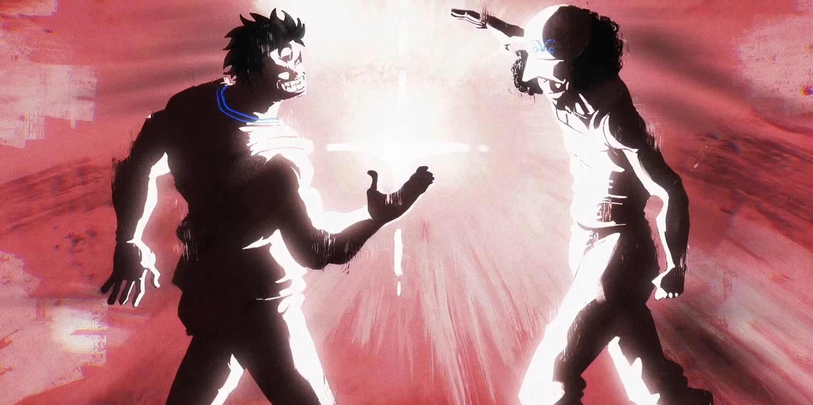

# override


## OverRide is the last `ISO` challenge of the trilogy. It's supposed to be the continuation of [RainFall](https://github.com/nimpoo/rainfall), and the hardest of the trilogy. It's basically the same as the previous `ISO` challenges, but the difficulty is increased : each levels have a binary to exploit.

For each levels, the methods are the same. All the files are `ELF binary` and the process will be the same as the previous challenges :
1. Test the program
1. Decompilation and/or disassembly
3. Analyse the code
4. Exploit the vulnerability

### Basically, reverse engineering (again)

Each levels can be a variation of all the exploitation we have learn in [RainFall](https://github.com/nimpoo/rainfall). To be honest, this challenge just help me to understand more about the exploitation and the security of the system and how `gdb` can be used to debug a program and khow more about the memory and the registers.

### It's a a cool project but a bit repetitive after finishing [RainFall](https://github.com/nimpoo/rainfall)

You'll see each `README.md` are shorter and go to the point directly, I want to make shorter and more efficient write-up for see how it can be done (and some levels are so incredibly easy).

# "_Congratulation **[Noah](https://github.com/noalexan)**, we have beat all the challenges_"



(I am Garp and Noah is Kuzan, despite the fact that Noah was more my coach than I was for him in all the challenges)

# Virtual Machine Setup

Again, it's the same setup as [RainFall](https://github.com/nimpoo/rainfall), the script can be found [here](assets/run.sh).

After launching the script, I connect to the virtual machine with `ssh` :

```sh
➜  ~ ssh level00@127.0.0.1 -p 4242
```

I use `scp` for the file transfer :

```sh
➜  ~ scp -P 4242 level00@127.0.0.1:/home/user/level00/level00 /Users/mayoub/Desktop
```

# _🚨 SPOILER ZONE 🚨_

## Summary from `level00` to `level08` :

- [`level00`](level00/README.md) : **Hardcoded Secret** - Decompilation and disassembly
- [`level01`](level01/README.md) : **Stack-Based Buffer Overflow** - `Ret2libc`
- [`level02`](level02/README.md) : **Format String Attack** - Stack accessibility
- [`level03`](level03/README.md) : **Hashing Algorithm** - `XOR` encryption (but this level is passed brainlessly)
- [`level04`](level04/README.md) : **Stack-Based Buffer Overflow** and **Process Manipulation** - `Ret2libc` and `gdb` (`follow-fork-mode`)
- [`level05`](level05/README.md) : **Format String Attack** - `GOT` overwriting by `shellcode` injection + `printf` limitation (**`high`/`low` order bytes**)
- [`level06`](level06/README.md) : **Binary recration** or **Code Skipping** - Easy serial number bypass or **overriding** security checks with `gdb` (`jump` command)
- [`level07`](level07/README.md) : **Stack-Based Buffer Overflow** and **Integer Overflow** - `Ret2Libc`
- [`level08`](level08/README.md) : **Reverse Engineering (only)** - file managing manipulation

## BONUS - `level09` :

- [`level09`](level09/README.md) : **Stack-Based Buffer Overflow** - `Ret2win` by exploiting **1 byte**

<br />

## MADE BY TWO REAL BRO :

<table>
  <tr>
    <td align="center"><a href="https://github.com/noalexan/"><br /><sub><b>Noah (noalexan)</b></sub></a><br /><a href="https://profile.intra.42.fr/users/noalexan" title="Intra 42"></a></td>
    <td align="center"><a href="https://github.com/nimpoo/"><br /><sub><b>Nimpô (mayoub)</b></sub></a><br /><a href="https://profile.intra.42.fr/users/mayoub" title="Intra 42"></a></td>
  </tr>
</table>
