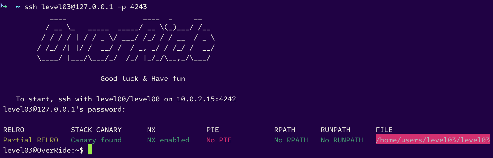
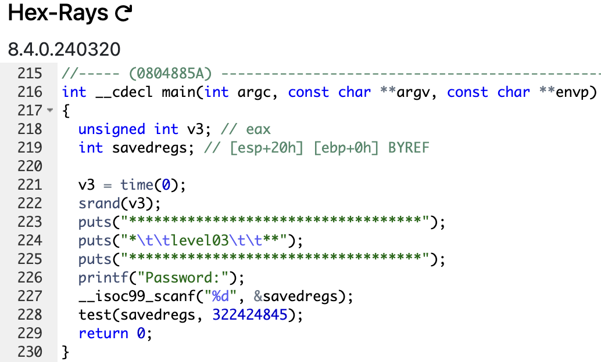
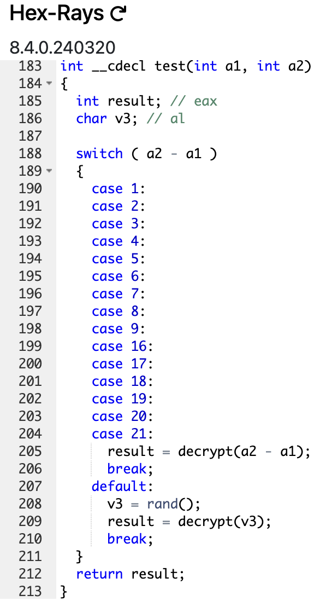
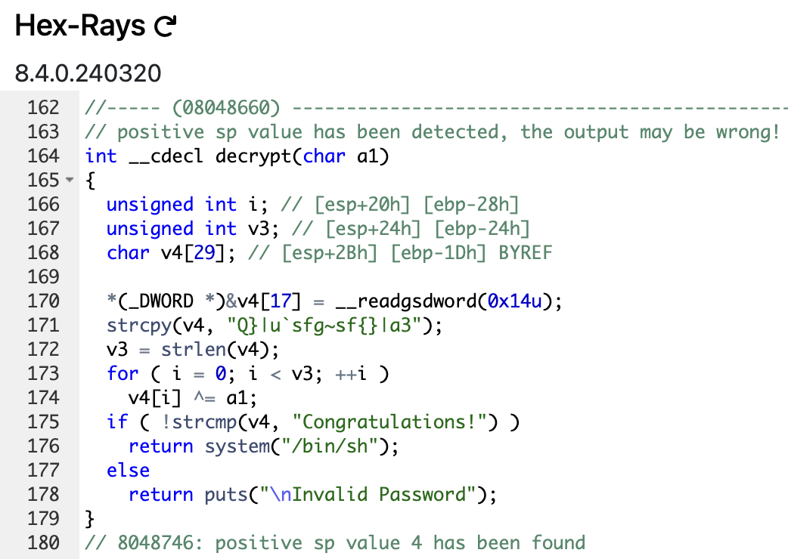

# level03



```sh
level03@OverRide:~$ ./level03
***********************************
*		level03		**
***********************************
Password:Garp>all

Invalid Password
level03@OverRide:~$ ./level03
***********************************
*		level03		**
***********************************
Password:root

Invalid Password
level03@OverRide:~$ ./level03 Kuma
***********************************
*		level03		**
***********************************
Password:Bonney

Invalid Password
level03@OverRide:~$
```



- The `main` function open the standard input, take our input and pass it to the function `test` as argument, and the number `322 424 845` as second argument.



- There is a `switch/case` of `a1 - a2` (`our argument - 322 424 845`).
- If the result is between `1` and `9` or `16` and `21`, the function `decrypt` is called with `a1 - a2` as argument.
- Else (`default`), `decrypt` is called with a random value as argument.



- It take the argument and `xor` it with the string ``Q}|u`sfg~sf{}|a3`` and if the result is `Congratulations!`, the shell is opened.

> We can notice 3 other unused functions : `prog_timeout`, `get_unum` and `clear_stdin`. I mention it but we will not use them for this level

By trying all case, we found the correct argument to pass to the function `decrypt` is `322 424 845 - 18 = 322 424 827`.

```sh
level03@OverRide:~$ ./level03
***********************************
*		level03		**
***********************************
Password:322424827
$ 
```

# _Again, our brain was not necessary..._

Go take the flag :

```sh
$ cat /home/users/level04/.pass
kgv3tkEb9h2mLkRsPkXRfc2mHbjMxQzvb2FrgKkf
$ 
```

And go to the next level :

```sh
level03@OverRide:~$ su level04
Password:
RELRO           STACK CANARY      NX            PIE             RPATH      RUNPATH      FILE
Partial RELRO   No canary found   NX disabled   No PIE          No RPATH   No RUNPATH   /home/users/level04/level04
level04@OverRide:~$
```

# level03 complet !


