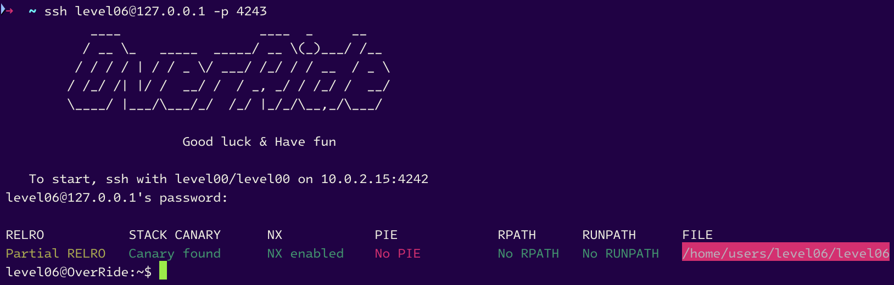
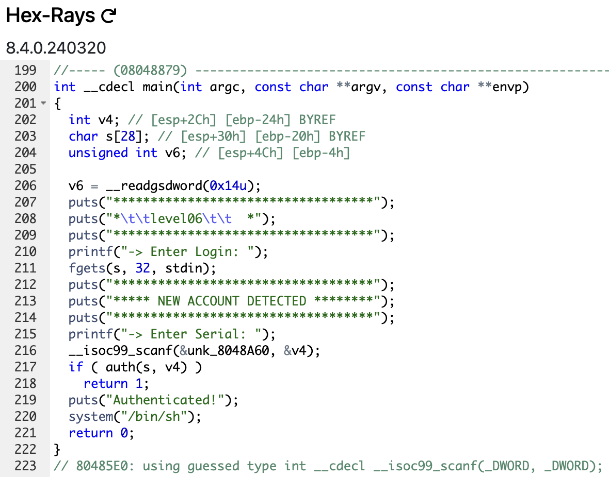
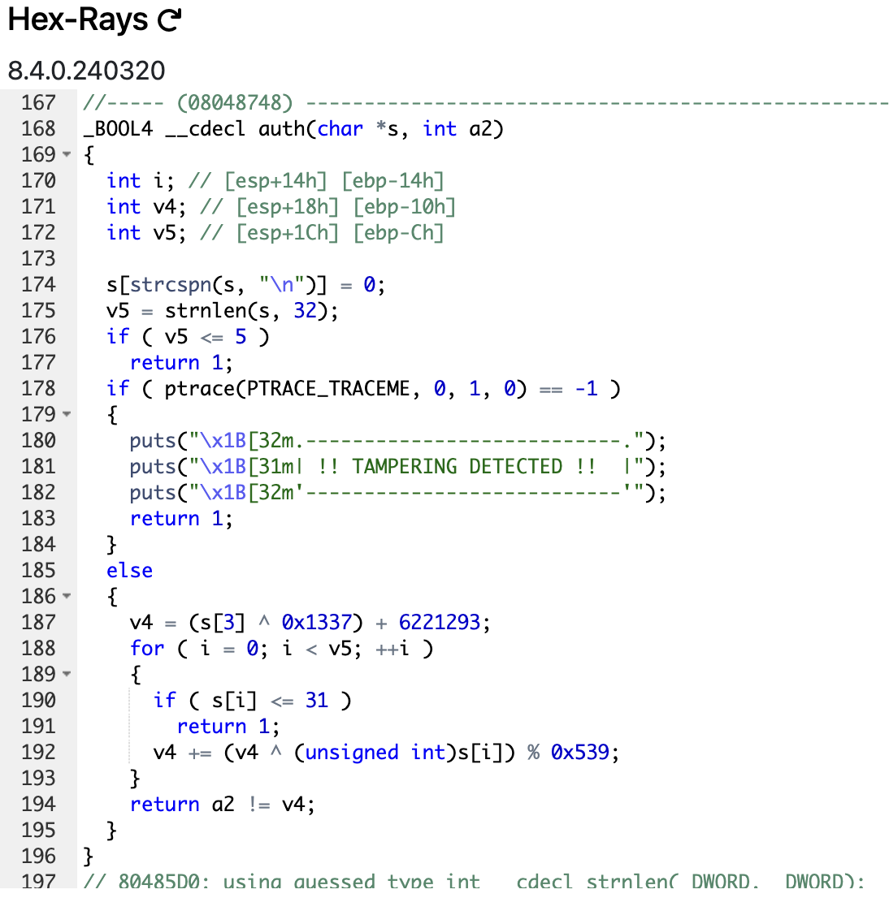

# level06



```sh
level06@OverRide:~$ ./level06
***********************************
*		level06		  *
***********************************
-> Enter Login: Gold
***********************************
***** NEW ACCOUNT DETECTED ********
***********************************
-> Enter Serial: Roger
level06@OverRide:~$ ./level06 Kizaru
***********************************
*		level06		  *
***********************************
-> Enter Login: Sakazuki
***********************************
***** NEW ACCOUNT DETECTED ********
***********************************
-> Enter Serial: Akainu
level06@OverRide:~$ 
```

 function `main`             |  function `auth`
:-------------------------:|:-------------------------:
  |  

- The `main` function reads a login and a serial from the user and calls the `auth` function with these two arguments.
If the `auth` function <u>returns **`1`**</u>, the program exits, otherwise, it prints `Authenticated!` and calls **`system("/bin/sh")`** (our objective).

- The `auth` function do the following:
	1. It checks if the length of the login is less than or equal to 5, if it is, it <u>returns **`1`**</u>.
	2. It checks if the process is being traced, if it is, it prints a `tampering detected` message and <u>returns **`1`**</u>.
	3. It calculates a value `v4` by xoring the 4th character of the login with `0x1337` and adding `6221293` to it.
	4. It iterates over the login and for each character, it checks if the character is less than or equal to 31 (only `ascii` characters), if it is, it <u>returns **`1`**</u>. Otherwise, it calculates a new value for `v4` by xoring the previous value of `v4` with the character and adding the result modulo `0x539` to `v4`.
	5. Finally, it returns the result (`true` or `false`) of the comparison between the serial and `v4` by using the `!=` operator.

## Our objective : <u>Found the serial of the login we put in the program</u>

# <u>Vulnerability</u> : Access to the `source code` of a binary

There is 2 ways to solve this level :

1. **<u>By using `gdb`</u>**. Disassembling the binary to analyze the value of the variable `v4` (the sereal of our login).

2. **<u>By testing the program in our machine</u>**. Simply by running the program and putting a login and a serial, and `printf` the value of `v4` to get the serial of the login we put in the program.

# 1. `gdb` Method

Befor explaining the plan for `gdb`, let's see what we can see by only debugging simply with `gdb` :

```sh
(gdb) r
Starting program: /home/users/level06/level06
***********************************
*		level06		  *
***********************************
-> Enter Login: Momonosuke Kozuki
***********************************
***** NEW ACCOUNT DETECTED ********
***********************************
-> Enter Serial: Pink Dragon
.---------------------------.
| !! TAMPERING DETECTED !!  |
'---------------------------'
[Inferior 1 (process 1766) exited with code 01]
(gdb) 
```

Yes, it's not possible to debugging because the function `ptrace` is called and if the process is being traced, it prints a `tampering detected` message and exits the program.

### The plan : <u>override this security</u> (OMG `OVERRIDE` IT'S THE NAME OF THE PROJECT HERE WE ARE IT'S FOR THAT)

Here's the plan :
- Set a `breakpoint` at the JUST BEFORE the comparison between the serial and `v4`, we will find the instruction `cmp` for found where the comparison is done.
- Run the program with `gdb`
- When the `breakpoint` is reached, print the value of `v4` and the serial of the login we put in the program.

### _AND WE'RE DONE ! It's that simple, no ?_

## 1. Set the `breakpoint` before the comparison

Let's disassemble the `main` function :
```sh
(gdb) disass main
Dump of assembler code for function main:
   0x08048879 <+0>:	push   ebp
   0x0804887a <+1>:	mov    ebp,esp
   0x0804887c <+3>:	and    esp,0xfffffff0
   0x0804887f <+6>:	sub    esp,0x50
   0x08048882 <+9>:	mov    eax,DWORD PTR [ebp+0xc]
   0x08048885 <+12>:	mov    DWORD PTR [esp+0x1c],eax
   0x08048889 <+16>:	mov    eax,gs:0x14
   0x0804888f <+22>:	mov    DWORD PTR [esp+0x4c],eax
   0x08048893 <+26>:	xor    eax,eax
   0x08048895 <+28>:	push   eax
   0x08048896 <+29>:	xor    eax,eax
   0x08048898 <+31>:	je     0x804889d <main+36>
   0x0804889a <+33>:	add    esp,0x4
   0x0804889d <+36>:	pop    eax
   0x0804889e <+37>:	mov    DWORD PTR [esp],0x8048ad4
   0x080488a5 <+44>:	call   0x8048590 <puts@plt>
   0x080488aa <+49>:	mov    DWORD PTR [esp],0x8048af8
   0x080488b1 <+56>:	call   0x8048590 <puts@plt>
   0x080488b6 <+61>:	mov    DWORD PTR [esp],0x8048ad4
   0x080488bd <+68>:	call   0x8048590 <puts@plt>
   0x080488c2 <+73>:	mov    eax,0x8048b08
   0x080488c7 <+78>:	mov    DWORD PTR [esp],eax
   0x080488ca <+81>:	call   0x8048510 <printf@plt>
   0x080488cf <+86>:	mov    eax,ds:0x804a060
   0x080488d4 <+91>:	mov    DWORD PTR [esp+0x8],eax
   0x080488d8 <+95>:	mov    DWORD PTR [esp+0x4],0x20
   0x080488e0 <+103>:	lea    eax,[esp+0x2c]
   0x080488e4 <+107>:	mov    DWORD PTR [esp],eax
   0x080488e7 <+110>:	call   0x8048550 <fgets@plt>
   0x080488ec <+115>:	mov    DWORD PTR [esp],0x8048ad4
   0x080488f3 <+122>:	call   0x8048590 <puts@plt>
   0x080488f8 <+127>:	mov    DWORD PTR [esp],0x8048b1c
   0x080488ff <+134>:	call   0x8048590 <puts@plt>
   0x08048904 <+139>:	mov    DWORD PTR [esp],0x8048ad4
   0x0804890b <+146>:	call   0x8048590 <puts@plt>
   0x08048910 <+151>:	mov    eax,0x8048b40
   0x08048915 <+156>:	mov    DWORD PTR [esp],eax
   0x08048918 <+159>:	call   0x8048510 <printf@plt>
   0x0804891d <+164>:	mov    eax,0x8048a60
   0x08048922 <+169>:	lea    edx,[esp+0x28]
   0x08048926 <+173>:	mov    DWORD PTR [esp+0x4],edx
   0x0804892a <+177>:	mov    DWORD PTR [esp],eax
   0x0804892d <+180>:	call   0x80485e0 <__isoc99_scanf@plt>
   0x08048932 <+185>:	mov    eax,DWORD PTR [esp+0x28]
   0x08048936 <+189>:	mov    DWORD PTR [esp+0x4],eax
   0x0804893a <+193>:	lea    eax,[esp+0x2c]
   0x0804893e <+197>:	mov    DWORD PTR [esp],eax
   0x08048941 <+200>:	call   0x8048748 <auth> # here's the call to the auth function
   0x08048946 <+205>:	test   eax,eax
   0x08048948 <+207>:	jne    0x8048969 <main+240>
---Type <return> to continue, or q <return> to quit---
   0x0804894a <+209>:	mov    DWORD PTR [esp],0x8048b52
   0x08048951 <+216>:	call   0x8048590 <puts@plt>
   0x08048956 <+221>:	mov    DWORD PTR [esp],0x8048b61
   0x0804895d <+228>:	call   0x80485a0 <system@plt>
   0x08048962 <+233>:	mov    eax,0x0
   0x08048967 <+238>:	jmp    0x804896e <main+245>
   0x08048969 <+240>:	mov    eax,0x1
   0x0804896e <+245>:	mov    edx,DWORD PTR [esp+0x4c]
   0x08048972 <+249>:	xor    edx,DWORD PTR gs:0x14
   0x08048979 <+256>:	je     0x8048980 <main+263>
   0x0804897b <+258>:	call   0x8048580 <__stack_chk_fail@plt>
   0x08048980 <+263>:	leave
   0x08048981 <+264>:	ret
End of assembler dump.
(gdb) 
```

The `auth` function is called at the line `<+200>`, let's disassemble the `auth` function to find the `cmp` instruction :

```sh
(gdb) disass auth
Dump of assembler code for function auth:
   0x08048748 <+0>:	push   ebp
   0x08048749 <+1>:	mov    ebp,esp
   0x0804874b <+3>:	sub    esp,0x28
   0x0804874e <+6>:	mov    DWORD PTR [esp+0x4],0x8048a63
   0x08048756 <+14>:	mov    eax,DWORD PTR [ebp+0x8]
   0x08048759 <+17>:	mov    DWORD PTR [esp],eax
   0x0804875c <+20>:	call   0x8048520 <strcspn@plt>
   0x08048761 <+25>:	add    eax,DWORD PTR [ebp+0x8]
   0x08048764 <+28>:	mov    BYTE PTR [eax],0x0
   0x08048767 <+31>:	mov    DWORD PTR [esp+0x4],0x20
   0x0804876f <+39>:	mov    eax,DWORD PTR [ebp+0x8]
   0x08048772 <+42>:	mov    DWORD PTR [esp],eax
   0x08048775 <+45>:	call   0x80485d0 <strnlen@plt>
   0x0804877a <+50>:	mov    DWORD PTR [ebp-0xc],eax
   0x0804877d <+53>:	push   eax
   0x0804877e <+54>:	xor    eax,eax
   0x08048780 <+56>:	je     0x8048785 <auth+61>
   0x08048782 <+58>:	add    esp,0x4
   0x08048785 <+61>:	pop    eax
   0x08048786 <+62>:	cmp    DWORD PTR [ebp-0xc],0x5
   0x0804878a <+66>:	jg     0x8048796 <auth+78>
   0x0804878c <+68>:	mov    eax,0x1
   0x08048791 <+73>:	jmp    0x8048877 <auth+303>
   0x08048796 <+78>:	mov    DWORD PTR [esp+0xc],0x0
   0x0804879e <+86>:	mov    DWORD PTR [esp+0x8],0x1
   0x080487a6 <+94>:	mov    DWORD PTR [esp+0x4],0x0
   0x080487ae <+102>:	mov    DWORD PTR [esp],0x0
   0x080487b5 <+109>:	call   0x80485f0 <ptrace@plt>
   0x080487ba <+114>:	cmp    eax,0xffffffff
   0x080487bd <+117>:	jne    0x80487ed <auth+165>
   0x080487bf <+119>:	mov    DWORD PTR [esp],0x8048a68
   0x080487c6 <+126>:	call   0x8048590 <puts@plt>
   0x080487cb <+131>:	mov    DWORD PTR [esp],0x8048a8c
   0x080487d2 <+138>:	call   0x8048590 <puts@plt>
   0x080487d7 <+143>:	mov    DWORD PTR [esp],0x8048ab0
   0x080487de <+150>:	call   0x8048590 <puts@plt>
   0x080487e3 <+155>:	mov    eax,0x1
   0x080487e8 <+160>:	jmp    0x8048877 <auth+303>
   0x080487ed <+165>:	mov    eax,DWORD PTR [ebp+0x8]
   0x080487f0 <+168>:	add    eax,0x3
   0x080487f3 <+171>:	movzx  eax,BYTE PTR [eax]
   0x080487f6 <+174>:	movsx  eax,al
   0x080487f9 <+177>:	xor    eax,0x1337
   0x080487fe <+182>:	add    eax,0x5eeded
   0x08048803 <+187>:	mov    DWORD PTR [ebp-0x10],eax
   0x08048806 <+190>:	mov    DWORD PTR [ebp-0x14],0x0
   0x0804880d <+197>:	jmp    0x804885b <auth+275>
   0x0804880f <+199>:	mov    eax,DWORD PTR [ebp-0x14]
   0x08048812 <+202>:	add    eax,DWORD PTR [ebp+0x8]
   0x08048815 <+205>:	movzx  eax,BYTE PTR [eax]
---Type <return> to continue, or q <return> to quit---
   0x08048818 <+208>:	cmp    al,0x1f
   0x0804881a <+210>:	jg     0x8048823 <auth+219>
   0x0804881c <+212>:	mov    eax,0x1
   0x08048821 <+217>:	jmp    0x8048877 <auth+303>
   0x08048823 <+219>:	mov    eax,DWORD PTR [ebp-0x14]
   0x08048826 <+222>:	add    eax,DWORD PTR [ebp+0x8]
   0x08048829 <+225>:	movzx  eax,BYTE PTR [eax]
   0x0804882c <+228>:	movsx  eax,al
   0x0804882f <+231>:	mov    ecx,eax
   0x08048831 <+233>:	xor    ecx,DWORD PTR [ebp-0x10]
   0x08048834 <+236>:	mov    edx,0x88233b2b
   0x08048839 <+241>:	mov    eax,ecx
   0x0804883b <+243>:	mul    edx
   0x0804883d <+245>:	mov    eax,ecx
   0x0804883f <+247>:	sub    eax,edx
   0x08048841 <+249>:	shr    eax,1
   0x08048843 <+251>:	add    eax,edx
   0x08048845 <+253>:	shr    eax,0xa
   0x08048848 <+256>:	imul   eax,eax,0x539
   0x0804884e <+262>:	mov    edx,ecx
   0x08048850 <+264>:	sub    edx,eax
   0x08048852 <+266>:	mov    eax,edx
   0x08048854 <+268>:	add    DWORD PTR [ebp-0x10],eax
   0x08048857 <+271>:	add    DWORD PTR [ebp-0x14],0x1
   0x0804885b <+275>:	mov    eax,DWORD PTR [ebp-0x14]
   0x0804885e <+278>:	cmp    eax,DWORD PTR [ebp-0xc]
   0x08048861 <+281>:	jl     0x804880f <auth+199>
   0x08048863 <+283>:	mov    eax,DWORD PTR [ebp+0xc]
   0x08048866 <+286>:	cmp    eax,DWORD PTR [ebp-0x10]
   0x08048869 <+289>:	je     0x8048872 <auth+298>
   0x0804886b <+291>:	mov    eax,0x1
   0x08048870 <+296>:	jmp    0x8048877 <auth+303>
   0x08048872 <+298>:	mov    eax,0x0
   0x08048877 <+303>:	leave
   0x08048878 <+304>:	ret
End of assembler dump.
(gdb) 
```

- We can see the lines `<+109>` and `<+114>`. `<+109>` call the function `ptrace` and `<+114>` it compares the return value of the function `ptrace` with `0xffffffff`. If the return value is `0xffffffff`, it prints a `tampering detected` message and exits the program.

1. We set a `breakpoint` at the line `<+114>` (`0x080487ba`) of the `auth` function.

2. We set another `breakpoint` at the line `<+286>` (`0x08048866`) of the `auth` function to print the value of `v4` before the comparison (print `ebp-0x10`).

3. When the first `breakpoint` is reached, we `jump` after the comparison (`0x080487ed`) to print the security, and continue the program.

```sh
(gdb) b *0x080487ba
Breakpoint 1 at 0x80487ba
(gdb) b *0x08048866
Breakpoint 2 at 0x8048866
(gdb) info b
Num     Type           Disp Enb Address    What
1       breakpoint     keep y   0x080487ba <auth+114>
2       breakpoint     keep y   0x08048866 <auth+286>
(gdb) 
```

Now, we can run the program with `gdb`, put a random login and serial, jump the `ptrace` call and `print` the serial of the login we put in the program :

```sh
(gdb) r
Starting program: /home/users/level06/level06
***********************************
*		level06		  *
***********************************
-> Enter Login: Momonosuke Kozuki
***********************************
***** NEW ACCOUNT DETECTED ********
***********************************
-> Enter Serial: 0 # We don't know the serial, so we put a random value

Breakpoint 1, 0x080487ba in auth ()
(gdb) jump *0x080487ed
Continuing at 0x80487ed.

Breakpoint 2, 0x08048866 in auth ()
(gdb) 
```

## Now, we can print the serial of the login we put in the program :

```sh
(gdb) print $ebp-0x10
$1 = (void *) 0xffffd678
(gdb)
```

_Hum okay... Go convert this address_

```sh
(gdb) print 0xffffd678
$2 = 4294956664
(gdb)
```

_Mmmhhh no, it's not that. It will be cast to an `int` ?_

```sh
(gdb) print *(int *)($ebp-0x10)
$3 = 6238140
(gdb)
```

_Okay, it seems correct, let's try this serial for `Momonosuke Kozuki`._

```sh
level06@OverRide:~$ ./level06
***********************************
*		level06		  *
***********************************
-> Enter Login: Momonosuke Kozuki
***********************************
***** NEW ACCOUNT DETECTED ********
***********************************
-> Enter Serial: 6238140
Authenticated!
$ 
```

## LEZGOOOOOOO IT WAS THAT

And let's get the flag :

```sh
$ cat /home/users/level07/.pass
GbcPDRgsFK77LNnnuh7QyFYA2942Gp8yKj9KrWD8
$
```

This method is interesting, a security is set up to prevent debugging, but we can override it by jumping the `ptrace` call and print the serial of the login we put in the program.

But the second method is more simple and more efficient, let's see it.

# 2. Testing the program in our machine

Okay for this method, we need to do our special move : **Gomu Gomu no Boh**


## 1. Copy the binary in our machine - <u>CHECK ✅</u>

## 2. Decompile the binary - <u>CHECK ✅</u>

## 3. Modify the binary for printing the serial before the comparison

In [our modify source code](Ressources/modified_source.c), we removed the `ptrace` call (I don't found the library and I am too lazy to find it, it's useless for our test here), at the line `32`, we adding the line `printf("Your login : [%s] --- Its serial : [%d]\n", s, v4);`, just after the calculation of the value `v4` (the serialisation).

## 4. Compile the modified source code and execute the binary

```sh
Ressources git:(main) ✗ gcc modified_source.c -o modified_level06
Ressources git:(main) ✗ ./modified_level06
***********************************
*               level06           *
***********************************
-> Enter Login: Monkey D. Garp
***********************************
***** NEW ACCOUNT DETECTED ********
***********************************
-> Enter Serial: The Hero of the Marines
Your login : [Monkey D. Garp] --- Its serial : [6237182]
Ressources git:(main) ✗ 
```

### We have pur serial, for `Monkey D. Garp` : it's `6237182`.

## 5. Put the serial in the original binary

```sh
level06@OverRide:~$ ./level06
***********************************
*		level06		  *
***********************************
-> Enter Login: Monkey D. Garp
***********************************
***** NEW ACCOUNT DETECTED ********
***********************************
-> Enter Serial: 6237182
Authenticated!
```

## Youpiiiiii...

```sh
$ cat /home/users/level07/.pass
GbcPDRgsFK77LNnnuh7QyFYA2942Gp8yKj9KrWD8
$ 
```

### We have the flag... Again and with much less effort...

Jokes aside, this method is more simple and more efficient, we can test the program in our machine and print the serial of the login we put in the program, it's even a vulnerability to let the user decomplie the binary and modify it.

# We can now move to the next level.

```sh
level06@OverRide:~$ su level07
Password:
RELRO           STACK CANARY      NX            PIE             RPATH      RUNPATH      FILE
Partial RELRO   Canary found      NX disabled   No PIE          No RPATH   No RUNPATH   /home/users/level07/level07
level07@OverRide:~$ 
```

# level06 complet !


